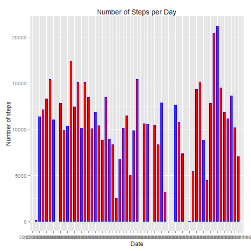
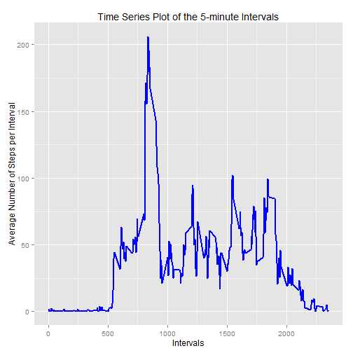
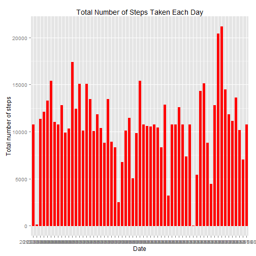
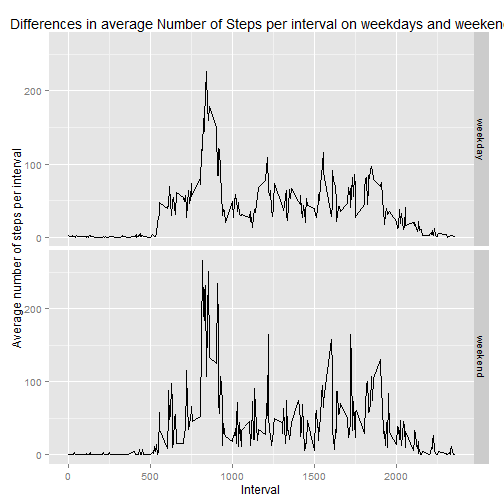

-------------------------------------------
title: "Reproducable Research Assignment 1"
Author: Niko Karajannis
output: html_document
-------------------------------------------

###Introduction

This assignment makes use of data from a personal activity monitoring device. This device collects data at 5 minute intervals through out the day. The data consists of two months of data from an anonymous individual collected during the months of October and November, 2012 and include the number of steps taken in 5 minute intervals each day. 


###Preliminaries


First, the data is read into R.


```r
data <- read.csv("C:/Users/NK/Desktop/activity.csv")
```

Then, the libraries dplyr ggplot2 and lubridate are called for. These three packages will be used in the analysis.


```r
library(dplyr)
library(ggplot2)
library(lubridate)
```


###What is the mean total number of steps taken per day?

First, we want to know about the total number of steps taken per day. By using the dplyr package (group_by, summarise, pipe operator), we group the data by the variable date, take the sum of steps for each day and apply it to the table Total_steps_per_day. Then, we use this table to make the first plot.


```r
Total_steps_per_day <- data %>%
arrange(date) %>%
group_by(date) %>%
summarise(total_steps_per_day = sum(steps))

ggplot(Total_steps_per_day, aes(date, total_steps_per_day)) + 
        geom_bar(stat = "identity",
        colour = "blue",
        fill = "red",
        width = 0.5) + 
        labs(title = "Number of Steps per Day") + 
        xlab("Date") + 
        ylab("Number of steps")
```

```
## Warning in loop_apply(n, do.ply): Removed 8 rows containing missing values
## (position_stack).
```

 

The resulting histogram shows the sum of steps for each day. In addition, we calculate the mean and median for the number of steps taken per day. As there are missing values in the dataset, they have to be removed from the calculation.


```r
mean(Total_steps_per_day$total_steps_per_day, na.rm=TRUE)
```

```
## [1] 10766.19
```

```r
median(Total_steps_per_day$total_steps_per_day, na.rm=TRUE)
```

```
## [1] 10765
```

As one can see, the median is slightly smaller than the mean. On average, the person makes 10766 steps per day.


###What is the average daily activity pattern?


For calculating the average daily pattern, the pipe operator from the dplyr package is used again. The data is grouped by the variable interval; then the mean per interval is taken and these means get applied to the table Average_steps_per_interval. Then, the second plot is made


```r
Avg_steps_per_int <- data %>%
    group_by(interval) %>%
    summarise(avg_steps_per_int = mean(steps, na.rm=TRUE))

ggplot(Avg_steps_per_int, aes(interval, avg_steps_per_int)) + 
        geom_line(color = "blue", fill = "red", size = 0.8) +
        labs(title = "Time Series Plot of the 5-minute Intervals") + 
        xlab("Intervals") +
        ylab("Average Number of Steps per Interval")
```

 

Using the function subset, the interval with the maximal number of steps taken, can be calculated 


```r
subset(Avg_steps_per_int, avg_steps_per_int == max(avg_steps_per_int))
```

```
## Source: local data frame [1 x 2]
## 
##   interval avg_steps_per_int
## 1      835          206.1698
```

As can be seen, the 835th interval has the maximal number of steps taken with a mean of 206.1698 steps.


###Imputing missing values

To get an idea of the number of NAs in the dataset, first, the number of NAs is calculated.


```r
table(is.na(data))
```

```
## 
## FALSE  TRUE 
## 50400  2304
```

There are 2304 missing values in the dataset. As it seems reasonable that the  number of steps are related to the time of the day, the suggestion is to impute missing values for an interval by taking the mean of steps taken in that interval across all days. This can be done by using a loop, where for all instances where the variable steps is na, the average number of steps for this interval gets imputed.


```r
Data_imputed <- data
for (i in 1:nrow(Data_imputed)){
if(is.na(Data_imputed$steps[i])){
Data_imputed$steps[i] <- Avg_steps_per_int[which(Data_imputed$int[i] == Avg_steps_per_int$interval),]$avg_steps_per_int
        }
    }
```

When the dataset is checked again, there are no more NAs.


```r
table(is.na(Data_imputed))
```

```
## 
## FALSE 
## 52704
```

Using the new dataset "Data_imputed"", a histogram of total steps taken each day is made.


```r
Total_steps_per_day_imputed <- Data_imputed %>%
    arrange(date) %>%
    group_by(date) %>%
    summarise(total_steps_per_day = sum(steps))

ggplot(Total_steps_per_day_imputed, aes(date, total_steps_per_day)) + 
                        geom_bar(stat="identity", fill="red", colour = "red", width = 0.5) + 
                        labs(title = "Total Number of Steps Taken Each Day") +
                        xlab("Date") +
                        ylab("Total number of steps")
```

 

Then, the mean and median of total steps taken each day are calculated.


```r
mean(Total_steps_per_day_imputed$total_steps_per_day)
```

```
## [1] 10766.19
```

```r
median(Total_steps_per_day_imputed$total_steps_per_day)
```

```
## [1] 10766.19
```


###Are there differences in activity patterns between weekdays and weekends?

Using the package lubridate, the weekdays for the variable date are calculated. Then the new variable is changed into a factor. Then the two levels weekday and weekend are applied.


```r
Data_imputed$weekday_weekend <- wday(Total_steps_per_day_imputed$date, label=TRUE, abbr=FALSE)

Data_imputed$weekday_weekend <- as.factor(Data_imputed$weekday_weekend)

levels(Data_imputed$weekday_weekend) <- list(weekday = c("Monday", "Tuesday", "Wednesday", "Thursday", "Friday"),
                                        weekend = c("Saturday", "Sunday"))
```

Again, a table is calculated so as to prepare the data for making a plot. Here, the mean of steps per interval across the two values "weekday" and "weekend" are calculated.
The two panel plot shows the differences in the average number of steps per interval taken on weekdays and weekends, respectively. 


```r
Mean_steps_per_weekday_end <- Data_imputed %>%
            group_by(interval, weekday_weekend) %>%
            summarise(mean_steps_per_weekday_end = mean(steps))


ggplot(Mean_steps_per_weekday_end, aes(interval, mean_steps_per_weekday_end)) + 
           geom_line() + 
           labs(title = "Differences in average Number of Steps per interval on weekdays and weekend") +
           xlab("Interval") +
           ylab("Average number of steps per interval") +
           facet_grid(weekday_weekend ~ .)
```

 

